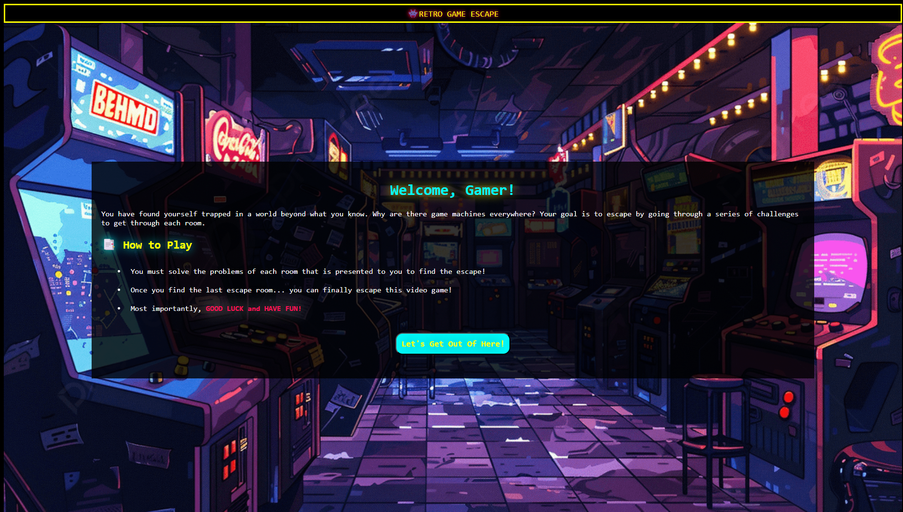

# 👾 Web'scape: A Retro-Themed Virtual Escape Room Game
Retro Game Escape is a browser-based interactive escape room experience, that challenges 
players to navigate four distinct rooms using clues and logic-driven puzzles.

The project emphasizes semantic HTML, advanced CSS state management, and DOM-based puzzle logic.



---
## ▶️ Live Demo 

###  👉 [Click Here to play!](https://usf-heatherho.github.io/webscape-retro-game/)

Each room level has escape hints at the bottom of each page.

---
## 🛠️ Technical Highlights
1. CSS State Management (The "Checkbox Hack")
Instead of relying on a heavy JavaScript framework for simple "if/then" visibility logic, I utilized the CSS Checkbox Hack and the `:checked pseudo-class`.

    * **Result**: This allows for instantaneous UI updates (opening doors, revealing clues) with zero latency and minimal script overhead.

2. Advanced CSS Transforms
To maintain the "8-bit console" aesthetic, I engineered custom animations using CSS keyframes:

    * **Warp Pipe Exit**: Implemented a `transform: rotateY(110deg)` transition to simulate a 3D perspective shift as the player exits the game.

    * **Hover Effects**: Created custom "pulsing" UI elements to guide player interaction without using intrusive pop-ups.

3. Logic-Based Puzzles (JavaScript)
The Room 2 Keypad Lock was developed using a specific JavaScript logic-gate:

    * Users must identify and select the correct two elements out of five to trigger the "Unlocked" state.

    * **Implementation**: Used event delegation to monitor element states and toggle a hidden checkbox to progress the game.

---
## 📂 Project Structure 
```
├── index.html          # Game Start / Lobby
├── room1.html          # The Hidden Coin (CSS Navigation)
├── room2.html          # Color Power Up (JS Logic Puzzle)
├── room3.html          # The Warp Room (3D Transforms)
├── room4.html          # The Final Step (CSS Hover)
├── escape.html         # Escape Screen
├── README.md
└── /assets             # Supporting Assets
    ├── common.css       # Global Styles & Retro Typography
    └── room2-logic.js  # Puzzle validation logic
```

---
## 🧠 Lessons Learned
* **User Experience (UX)**: Designing puzzles that are challenging but intuitive taught me the importance of visual feedback (changing cursor types, color shifts on hover).

* **Modular CSS**: Using a single common.css file for shared retro elements (borders, fonts) while allowing room-specific styles kept the codebase DRY (Don't Repeat Yourself).
